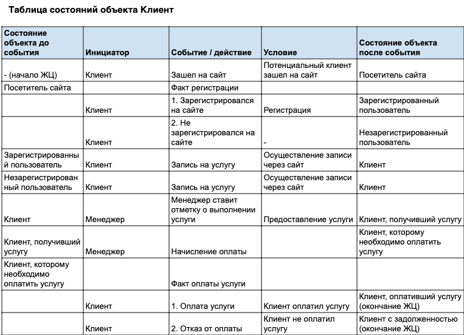

## Exercise 04 — State table (Таблица состояний)     
**Объекты (сущности предметной области), имеющие жизненный цикл:** Запись, Клиент, Оплата, Расписание    

**Объект:**  Клиент  
**Цель построения таблицы:** Получить полное представление о состояних объекта "клиент" в рамках системы барбершопа.  
**Область рассмотрения:** to be (какое состояние системы мы ожидаем увидеть).   

  
*Рис. 1. Диаграмма состояний объекта "клиент" проекта барбершоп* 