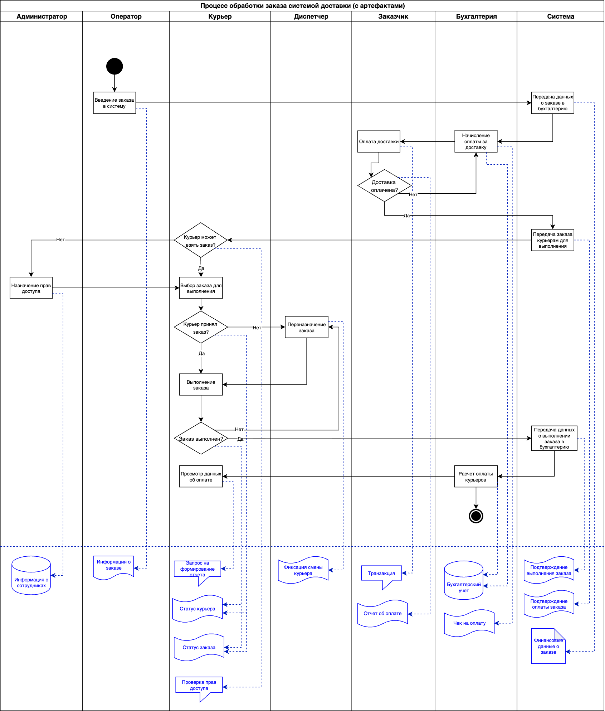

## Exercise 02 — Addition a Swimlane diagram (Дополнение диаграммы «плавательные дорожки»)
**Цель построения диаграммы:** дополнить диаграмму "плавательные дорожки" создаваемыми в процессе доставки заказа артефактами (документы, разработанный код, зарегистрированные ошибки, запросы и т. д.) для более глубокого понимания процесса.
  
**Область рассмотрения:** to be (какое состояние системы мы ожидаем увидеть).   

  
*Рис. 1. Диаграмма "Плавательные дорожки" для проекта доставки заказов (расширенная)* 