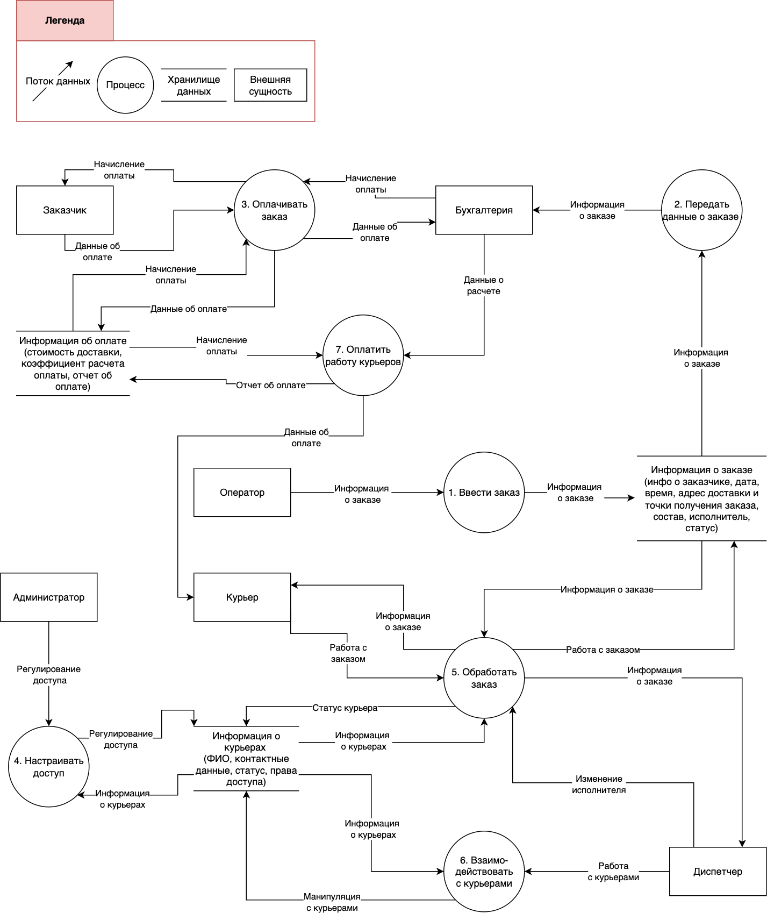

## Exercise 00 — Building DFD, level 0 (Построение диаграммы потоков данных, уровень 0)
**Цель построения диаграммы:** определить процессы преобразования системы доставки заказов, совокупность (хранилище) данных или материалов, которыми система управляет, и потоки данных или материалов между процессами, хранилищами и внешним миром.   
  
**Область рассмотрения:** to be (какое состояние системы мы ожидаем увидеть).  

  
*Рис. 1. Диаграмма потоков данных для проекта доставка товаров* 
