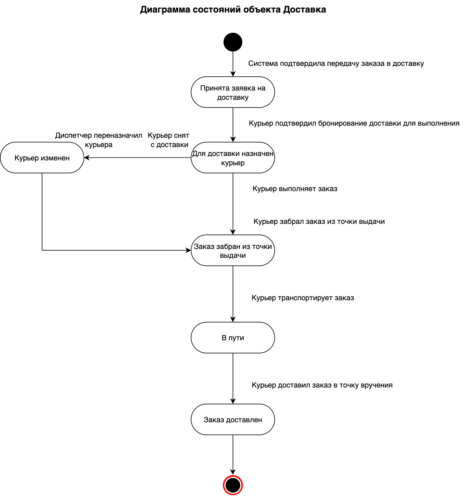

## Exercise 03 — State diagram (Диаграмма состояний)
**Цель построения диаграммы:** Получить полное представление о состояних объекта "доставка" в рамках системы доставки заказов.
  
**Область рассмотрения:** to be (какое состояние системы мы ожидаем увидеть).   

**Объект:**  Доставка  

  
*Рис. 1. Диаграмма состояний объекта "доставка" проекта доставки заказов* 