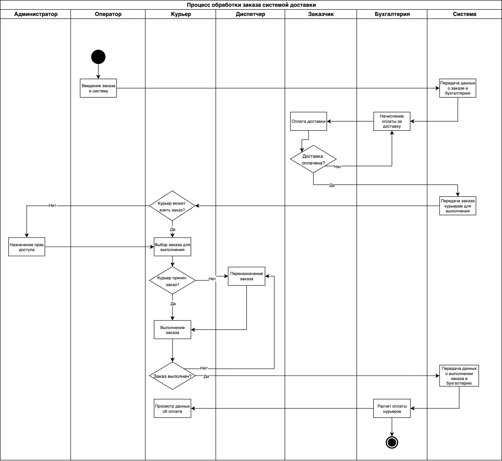

## Exercise 01 — Building a Swimlane diagram (Построение диаграммы «плавательные дорожки»)
**Цель построения диаграммы:** представить в удобном виде, из каких шагов состоит бизнес-процесс работы службы доставки заказов, какая роль отвечает за каждый из процессов, а также выявить потенциальные проблемные места системы.
  
**Область рассмотрения:** to be (какое состояние системы мы ожидаем увидеть).   

**Действующие роли:** Администратор, Оператор, Курьер, Заказчик, Диспетчер, Бухгалтерия, Система (процессы, выполняемые автоматически)

  
*Рис. 1. Диаграмма "Плавательные дорожки" для проекта доставки заказов* 