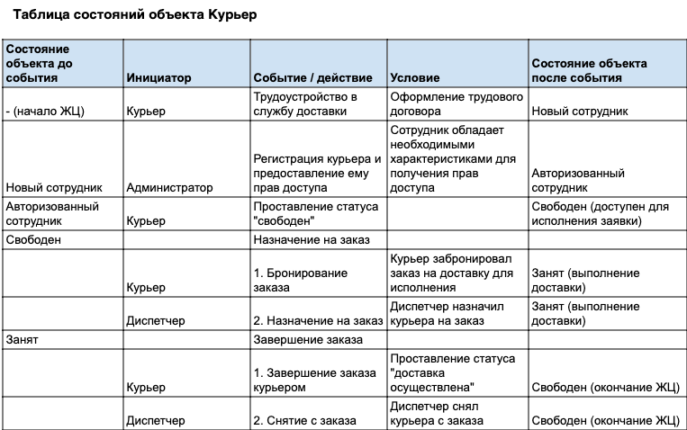

## Exercise 04 — State table (Таблица состояний)     
**Объекты (сущности предметной области), имеющие жизненный цикл:** Доставка, Заказ, Курьер, Оплата  

**Объект:**  Курьер  
**Цель построения таблицы:** Получить полное представление о состояних объекта "курьер" в рамках системы доставки заказов.  
**Область рассмотрения:** to be (какое состояние системы мы ожидаем увидеть).   

  
*Рис. 1. Диаграмма состояний объекта "курьер" проекта доставки заказов* 